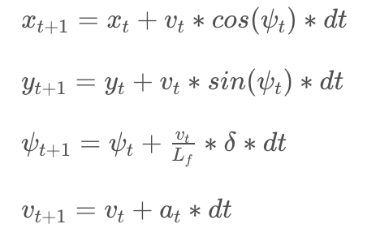

# Model Predictive Control Project
Self-Driving Car Engineer Nanodegree Program

---

This project implements the MPC tecnique for choosing trajectories by minimizing the
cost relative to a reference path, then choosing the actuator values
which minimize error in a next step.

## The Model

The state calculated by the MPC method is comprised of the following  parameters:
- x position of the vehicle.
- y position of the vehicle.
- psi: vehicle orientation. 
- v: vehicle speed.
- cte: cross-track error.
- epsi: orientation error.

The actuators which are used
- delta: steering angle.
- a: throttle value.

## Latency compensation
A 100 ms. latency between measurement and calculation is expected. To compensate
for this, a kinematic vehicle model is used. It is assumed there are no dynamic
effects taken into account by the simulator.

The following equations are used to account for the latency, with 'dt'=0.1s.  

# Waypoint processing
The reference path is first translated to coordinates relative to the car, then a 3rd
degree polynomial is fitted to it. The coefficients for this polynomial are then used
in the MPC calculation.  

## Number and duration of timesteps
The number of predicted timesteps(N) and the duration of each timestep(dt) was chosen to
maximize the accuracy of the prediction, by being able to look ahead further in the path,
but also to optimize the processing time of the MPC controller.    
In order to optimize these parameters, the processing time for each message coming from the
simulator is logged. Looking at this, together with the performance of the controller, 
allows us to choose the best values. It was found the higher limit(which corresponds to the
latency) on the timestep duration worked well, allowing us to choose smaller values of N.
N values larger than 10 were found to occassionally take the processing time over the latency
period, which induces erratic behaviour.  

## Additional tuning
At higher speeds than 40mph. it was found the car would react with high values of steering.
This would induce violent oscilations on the vehicle.  
Factors were introduced in the error calculation for the steering values so that the gap
between successive steps is diminished. Correct values would highly depend on the maximum speed
of the vehicle, and were found mostly by trial and error. Good values were found on about
a 1000 multiplier for the delta and 1400 for the gap.

## Result

